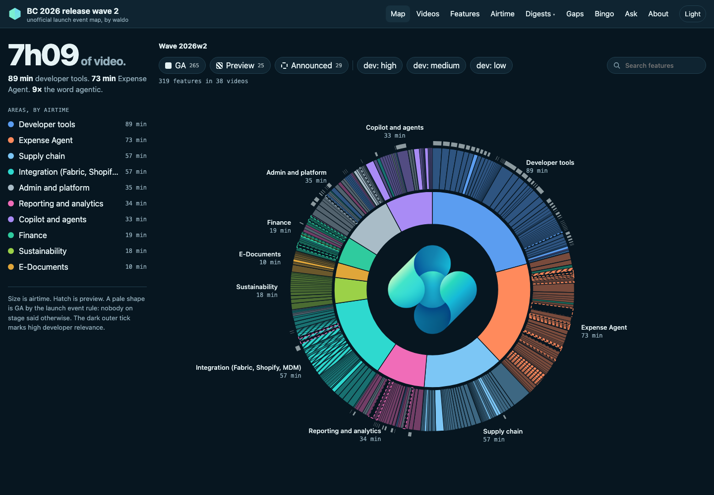
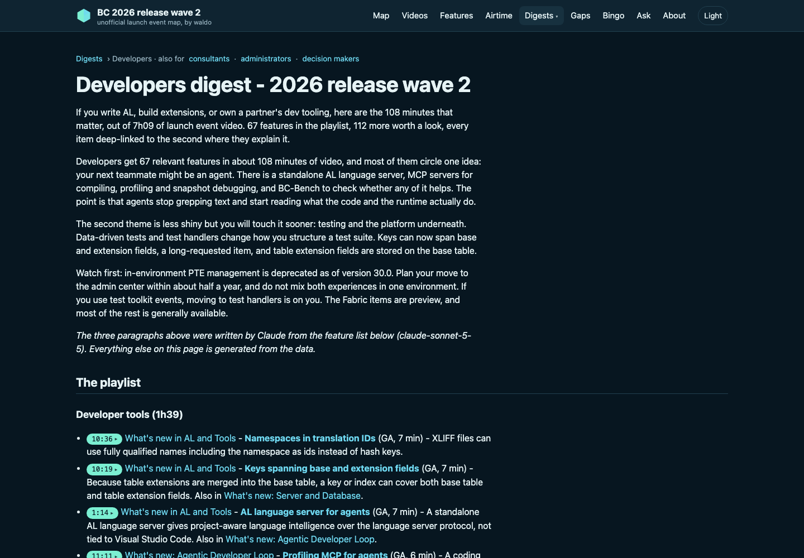
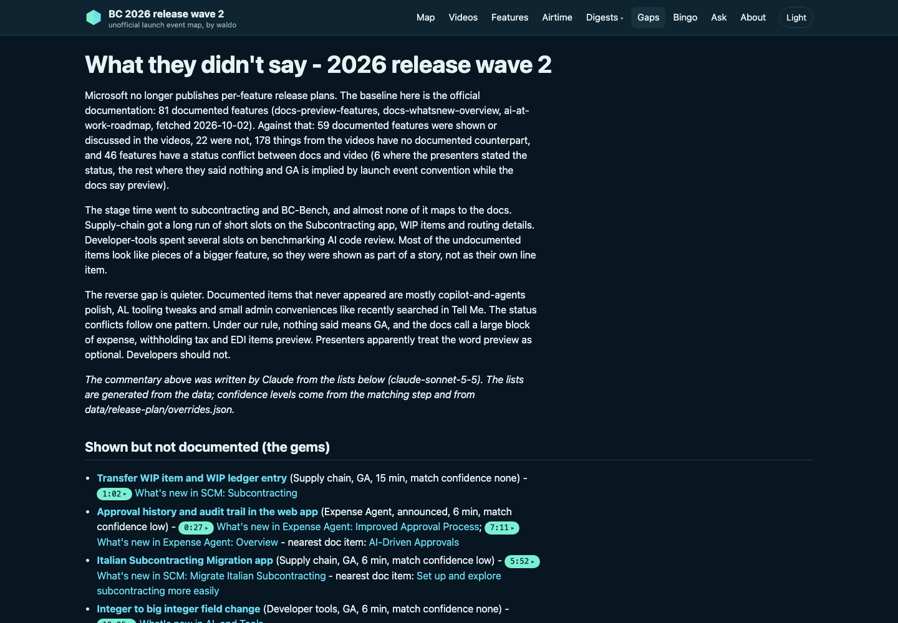

# msdyn365-2026-release-wave-2

**The Business Central 2026 release wave 2 launch event, as a map.** 38 videos, 7 hours 9 minutes,
turned into a repository that an LLM agent can navigate on its own and a static site that humans
can click through. Unofficial, made by [waldo](https://www.waldo.be). Every claim links to a
video and a second.

**Site:** https://waldo1001.github.io/msdyn365-2026-release-wave-2/

<!-- numbers:start -->
## By the numbers

| | |
|---|---|
| Videos / footage | 38 videos, 7h09 |
| Features extracted and merged | 319 (from 371 per-video candidates) |
| Status (GA unless the presenters said otherwise) | 265 GA (17 said on stage, 248 by the launch event rule), 25 preview, 29 announced for later |
| Developer relevance high / medium / low | 67 / 112 / 140 |
| Developer digest | 108 minutes that matter |
| Documented features (Microsoft docs + roadmap) | 81: 59 shown, 22 not shown, 46 status conflicts (6 with a stated status) |
| Shown but not documented | 178 |
| Copilot and agents | 25% of the footage (107 min of videos in those areas) |
| Most said buzzword | "agent" 150 times, "agentic" 9 times |
<!-- numbers:end -->

<!-- screenshots:start -->
## Screenshots

| The map | Developer digest | What they didn't say |
|---|---|---|
|  |  |  |

More in [`docs/screenshots/`](docs/screenshots/), including the 390px mobile captures.
<!-- screenshots:end -->

## What is in here

| For agents | For humans |
|---|---|
| [`AGENTS.md`](AGENTS.md): how to find and cite things | [The map](https://waldo1001.github.io/msdyn365-2026-release-wave-2/): zoomable wave, areas, features |
| [`llms.txt`](llms.txt) and [`llms-full.txt`](llms-full.txt) | [Videos](https://waldo1001.github.io/msdyn365-2026-release-wave-2/videos/) with timeline strips |
| [`data/index/features.json`](data/index/features.json): the feature graph | [Features](https://waldo1001.github.io/msdyn365-2026-release-wave-2/features/): filterable table |
| [`data/features/`](data/features/), [`data/videos/`](data/videos/), [`data/areas/`](data/areas/): frontmatter markdown | [Digests](https://waldo1001.github.io/msdyn365-2026-release-wave-2/digests/): the minutes that matter, for developers, consultants, administrators and decision makers |
| [`data/index/gap-analysis.json`](data/index/gap-analysis.json) | [What they didn't say](https://waldo1001.github.io/msdyn365-2026-release-wave-2/what-they-didnt-say/) |
| [`data/index/airtime.json`](data/index/airtime.json), [`wordcount.json`](data/index/wordcount.json), [`timelines.json`](data/index/timelines.json) | [Airtime](https://waldo1001.github.io/msdyn365-2026-release-wave-2/airtime/), [Bingo](https://waldo1001.github.io/msdyn365-2026-release-wave-2/bingo/), [Ask the event](https://waldo1001.github.io/msdyn365-2026-release-wave-2/ask/) |
| [`data/transcripts/full/`](data/transcripts/full/): cleaned transcripts (private build) | [About](https://waldo1001.github.io/msdyn365-2026-release-wave-2/about/) |

The brief this was built from, the design brief for the visual pass and the operator runbook
are in [`docs/brief/`](docs/brief/), unchanged. [`docs/PLAN.md`](docs/PLAN.md) is the
interpretation, [`docs/DECISIONS.md`](docs/DECISIONS.md) the choices made along the way,
[`docs/REPORT.md`](docs/REPORT.md) the final report, [`docs/agent-smoke-test.md`](docs/agent-smoke-test.md)
three questions answered the way an agent would.

## Principles

- **Transcripts are the source of truth.** Summaries, features and quotes come from the
  captions, nothing else. Quotes are validated against the transcript; the ones that fail are
  dropped, not fixed.
- **Every quote deep-links** to `https://www.youtube.com/watch?v=<id>&t=<seconds>s`.
- **Rebuildable.** `npm run build` goes from the raw captions to `site/dist` using the
  committed LLM cache, so no model is called and no key is needed.
- **Agent-navigable first.** Frontmatter on every markdown file, one JSON that answers most
  questions, an `AGENTS.md` that explains the rest.
- **Microsoft's content, handled with care.** See [`CONTENT-NOTICE.md`](CONTENT-NOTICE.md).
  `scripts/strip-for-public.sh` removes the full transcripts before the repository goes public.

## How it is built

```
data/transcripts/raw/*.vtt           YouTube auto-captions (scripts/get-bcle-transcripts.sh)
  01-clean-vtt       -> data/transcripts/full/<id>.{json,md}      segments with timestamps
  02-extract   (LLM) -> pipeline/out/02-extract/<id>.json         summary, chapters, features, quotes, disclaimers
  03-merge     (LLM) -> data/index/features.json                  one feature graph across videos
  04-match     (LLM) -> data/release-plan/2026w2.json + matches   Microsoft's documented features
  05-analytics       -> airtime.json, wordcount.json, timelines.json, gap-analysis.json
  06-render          -> data/videos/, data/features/, data/areas/, data/reports/, llms*.txt
  07-search          -> data/index/search.json
site/build.ts        -> site/dist/                                 the static site
```

The LLM steps call `claude -p` (Claude Code in headless mode) on waldo's Claude subscription.
No API key anywhere. Every call is cached in `pipeline/.cache/` keyed by prompt version, model
and input, and the cache is committed: a clean clone rebuilds everything without a network call
to Anthropic. `pipeline/lib/llm.ts` has a second backend (`LLM_BACKEND=api` with
`ANTHROPIC_API_KEY`) that is never required.

Models: `sonnet` for the per-video extraction, `opus` for the cross-video merge and the docs
matching. Override with `LLM_MODEL=opus`.

## Run it

```bash
npm ci
npm run build          # steps 01-07 from cache + site -> site/dist, no LLM calls
npm run site:serve     # http://localhost:4173/msdyn365-2026-release-wave-2/

# re-run with LLM calls allowed (needs the claude CLI logged in)
npm run wave -- 2026w2

# single steps
npm run step:02 -- --only D_Lur52IrIg,qs1cg-GoDeQ --force

# checks
npm run check:quotes                                   # 10 random quotes vs transcript
npx tsx scripts/site-check.ts                          # 390px overflow, console errors, screenshots
npm run check:public -- --transcripts ../private/data/transcripts/full   # after strip-for-public
```

`LLM_CACHE_ONLY=1` (set by `npm run build` and by CI) turns a cache miss into an error.

## Next wave

Two halves, because transcripts need YouTube access and the LLM steps need the Claude
subscription:

1. **On waldo's Mac:** add the wave to `config/waves.json`, fetch the captions with
   `scripts/get-bcle-transcripts.sh 2027-04-DD` into `data/transcripts/raw/`, copy the new
   `videos.json`, then `npm run wave -- 2027w1`. Steps 01 to 03 run with LLM calls, the rest
   follows; commit `data/`, `pipeline/out/` and `pipeline/.cache/`. Already processed videos
   are cache hits, so a re-run is free.
2. **On GitHub:** the `new-wave` workflow (`workflow_dispatch`, input `wave`) runs the
   deterministic steps 04 to 07 and the site build from the committed data and opens a pull
   request. `build-and-deploy` deploys `main` to Pages on every push.

## Fork this for the next wave

The repository is named after the wave on purpose. For the next one:

```bash
gh repo create waldo1001/msdyn365-2027-release-wave-1 --private --clone
# copy pipeline/, site/, scripts/, config/, .github/, package*.json, AGENTS.md, CONTENT-NOTICE.md
./scripts/setup-github.sh waldo1001/msdyn365-2027-release-wave-1
```

`scripts/setup-github.sh` is idempotent and does everything the brief's "GitHub setup" section
asks: repo, topics, Pages with the Actions source, Actions permissions, squash-only merges,
homepage. No secrets are created.

## Going public

```bash
./scripts/strip-for-public.sh      # removes full transcripts, raw captions, the extraction cache and the passage index
npm run build                      # public mode: search covers summaries, chapters, quotes and features
gh repo edit --visibility public --accept-visibility-change-consequences
```

## License

Code: MIT ([`LICENSE`](LICENSE)). Transcripts and derived content: Microsoft's material, see
[`CONTENT-NOTICE.md`](CONTENT-NOTICE.md).
